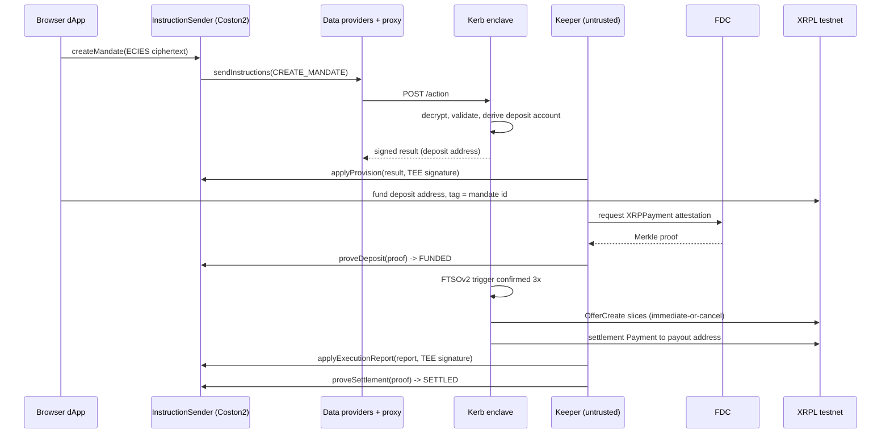

# Kerb architecture

Kerb is confidential order automation for the native XRPL DEX: the strategy
(trigger level, sizes, timing) lives only inside a Flare Confidential Compute
enclave, while every money movement is provable on-chain. This document maps
the runtimes, the exact signing and proof boundaries, and the failure paths.
The one-page product view lives in [README.md](README.md); the operational
bring-up lives in [docs/RUNBOOK.md](docs/RUNBOOK.md).

## Components

| Component | Path | Runtime | Role |
| --------- | ---- | ------- | ---- |
| InstructionSender | [`contracts/InstructionSender.sol`](contracts/InstructionSender.sol) | Flare Coston2 | Mandate registry, instruction fan-out, TEE result ingestion, FDC proof gates |
| Kerb extension | [`typescript/src/app/`](typescript/src/app/) | TEE enclave (tee-node v0.0.24) | Decrypts mandates, derives per-mandate XRPL keys, watches FTSOv2, trades and settles |
| Keeper | [`typescript/src/tools/keeper.ts`](typescript/src/tools/keeper.ts) | Anywhere, untrusted | Relays signed enclave results on-chain (FCC has no result callback) |
| FDC tool | [`typescript/src/tools/fdc.ts`](typescript/src/tools/fdc.ts) | Anywhere, untrusted | Drives the four-step XRPPayment attestation flow for deposits and settlements |
| Market maker | [`typescript/src/tools/market-maker.ts`](typescript/src/tools/market-maker.ts) | Outside the TEE | Demo liquidity: issues a test USD and quotes around the live FTSO price |
| dApp | [`webapp/`](webapp/) | Browser | Encrypts mandates client side (go-ethereum-compatible ECIES), submits, reads mandate state from the contract |
| Deploy tooling | [`go/tools/`](go/tools/) | Developer machine | Deploys, registers the extension and machine, runs the on-chain E2E test |

## The mandate lifecycle, end to end

The enclave re-reads the on-chain mandate status immediately before every
signature ([`typescript/src/app/engine.ts`](typescript/src/app/engine.ts),
`executeSlice`), so a cancellation that lands on-chain stops execution even if
the CANCEL_MANDATE instruction is never delivered.

## What is signed, what is proven, what is trusted

Three distinct mechanisms carry trust, and they do not overlap:

**TEE signature (provisioning and execution reports).** The node signs
`keccak256(abi.encode("TEE_ACTION_RESULT", chainId, resultHash))` where
`resultHash` covers only the ActionResult fields Data, ID, SubmissionTag and
Status (sourceRef: tee-node `pkg/types/actions.go`). The contract mirrors this
in `_requireTeeResult` and refuses everything else, including the unsigned
`Log`, `OPType` and `OPCommand` fields. Because the signature is the
authorisation, `applyProvision` and `applyExecutionReport` are permissionless:
any relayer works, no relayer is trusted.

**FDC proofs (money movement).** A mandate becomes FUNDED only through
`proveDeposit`: an `XRPPayment` attestation whose `receivingAddressHash`
matches the mandate's deposit address, whose destination tag equals the
mandate id, and whose XRPL transaction has not been consumed as a proof
before (`provenTransactions` replay map). A mandate becomes SETTLED only
through `proveSettlement`: an attestation whose `sourceAddressHash` matches
the deposit address. The enshrined data protocol, not the TEE, asserts both.

**Enclave trust (the residual).** The contract cannot check the settlement's
destination, because the payout address is part of the encrypted mandate. The
enclave is trusted to pay the address the user sealed. Anti-rug roadmap:
user-held cosigners on withdrawals via `TeeInstructionParams.cosigners`, and
`ReferencedPaymentNonexistence` attestations to prove a missed settlement
against an operator bond.

## Key derivation

One 32 byte master seed enters the enclave once, ECIES-encrypted through
`initSeed(bytes)` (owner only). Every mandate's XRPL account derives as
HMAC-SHA256(seed, `"kerb/v1/mandate/<id>"`), truncated to the 16 bytes of
entropy an XRPL seed carries ([`typescript/src/app/wallet.ts`](typescript/src/app/wallet.ts)).
Replaying the same seed after a restart rebuilds identical addresses; the
enclave refuses a different seed while mandates hold derived keys
([`typescript/src/app/handlers.ts`](typescript/src/app/handlers.ts),
`handleInitSeed`).

## Execution rules

- **Trigger**: FTSOv2 block-latency XRP/USD, normalised to a 12 decimal
  fixed-point scale; the condition must hold for 3 consecutive reads
  (`TRIGGER_CONFIRMATIONS`), and any breaking read resets the run.
- **Slicing**: orders leave as `OfferCreate` with `tfImmediateOrCancel`, so
  nothing rests on the book. Slice size carries up to 50% jitter, computed in
  integer basis points.
- **Measured fills**: an immediate-or-cancel order returns `tesSUCCESS` even
  when it crosses nothing, so the engine counts only the account's validated
  XRP balance change, fee separated ([`typescript/src/app/xrpl.ts`](typescript/src/app/xrpl.ts),
  `measureFilledDrops`). On-chain, `applyExecutionReport` additionally
  enforces that the reported fill never decreases.
- **Slippage**: percent converted to basis points, applied as a floor on
  proceeds (sell) or a ceiling on spend (buy); issued-currency values are
  rounded in the direction that preserves the bound when XRPL's 15
  significant digits truncate.
- **No floats**: every amount is BigInt drops or fixed-point scaled integers,
  from JSON parsing to order construction.

## Failure paths and recovery

- **Slice finds no liquidity**: the IOC order cancels itself; the engine
  retries on the next confirmed trigger. Nothing is counted as filled.
- **Cancellation race**: status is re-read between trigger and signature; a
  cancel that lands in that window skips the slice.
- **Payout trustline missing**: detected at execution start (warning) and at
  settlement (distinct failure message, no doomed payment). The user opens
  the line and settlement is retried; the funds sit in the deposit account
  meanwhile.
- **Settlement**: two independent legs (issued-currency proceeds, then XRP
  above the reserve minus a 1000 drop fee cushion); one stuck leg never
  blocks the other.
- **Enclave restart**: mandate records are in-memory. Replaying the seed
  restores key material, but live mandates are not re-hydrated, and under
  `SIMULATED_TEE=true` a restart also mints a new TEE identity. Operational
  rule: never restart while a mandate holds funds (docs/RUNBOOK.md, section
  4). Funds are never lost by a restart, because the deposit accounts
  re-derive from the seed; recovery is manual settlement.
- **Engine crash**: a crashed engine is deliberately not restarted, because a
  fresh engine would reset its local fill counter and could re-trade past the
  mandate total. Dead engines hold no funds hostage.

## Confidentiality boundary and residual leaks

Sealed: trigger level and direction, slice size, jitter, slippage bound,
expiry, payout address, DCA schedule. `GET /state` exposes only counts and a
version ([`typescript/src/app/handlers.ts`](typescript/src/app/handlers.ts),
`reportState`), and the test suite asserts nothing confidential appears in it.

Public by construction, stated honestly: the deposit amount (visible on
XRPL), the fill timing (visible as DEX trades), and the mandate count. Slices
plus jitter blur the order's shape; they do not hide that trading happened.
