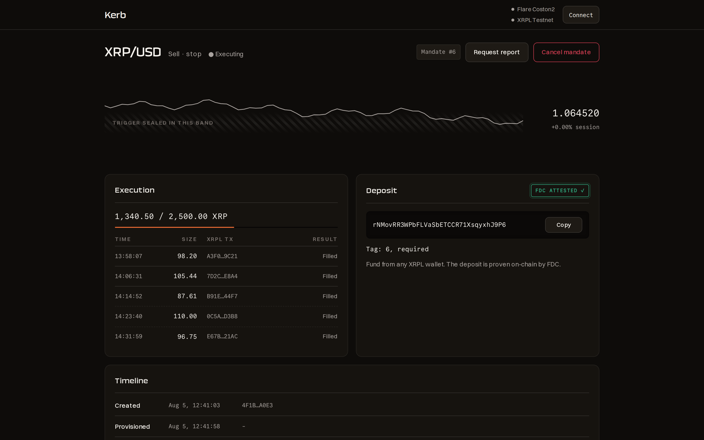
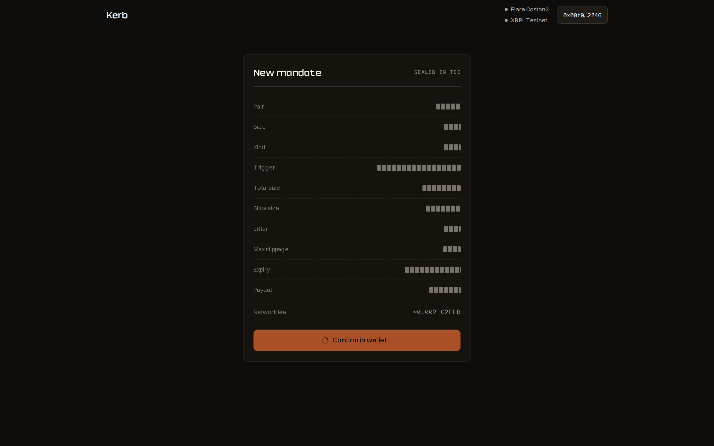
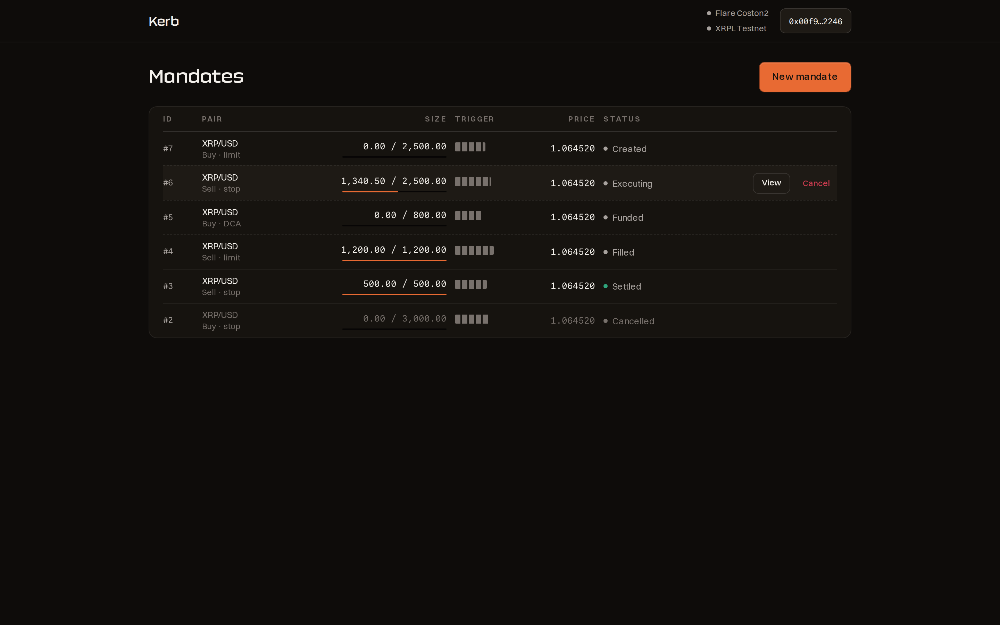
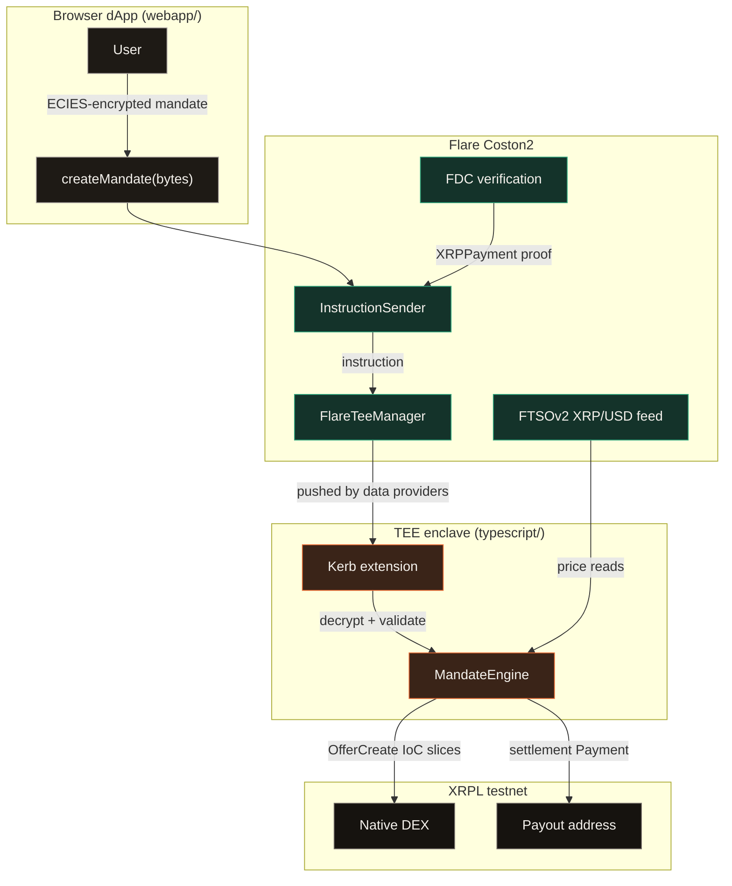

<p align="center">
  
</p>
<h1 align="center">Kerb</h1>
<p align="center">
Non-custodial stop, limit and DCA automation for the native XRPL DEX, where
an encrypted mandate inside a Flare TEE, not a bot holding your keys, decides
when to trade. The trigger price never exists in cleartext outside the
enclave; every deposit, fill and settlement is provable on-chain through FDC
attestations.
</p>
<p align="center">Built for the Flare Summer Signal hackathon, track 2
(Confidential Compute Apps).</p>

<p align="center">
  
  
  
  
  
</p>



| The strategy sealing at submission                          | Every mandate at a glance                        |
| ----------------------------------------------------------- | ------------------------------------------------ |
|  |  |

## 🎯 The problem

Put a stop-loss on an exchange and you hand over custody plus your exact
exit price; front-runners and the venue itself can see the level and trade
against it. Run it yourself with a bot and the bot holds your keys and its
strategy sits readable on a server. Post it as an on-chain limit order and
the whole book can read your size and your level before it fills.

The trust gap: nobody has both "my keys stay mine and my trigger stays
secret" and "everyone can verify the execution happened honestly". Kerb
closes it with a TEE for the secrecy and two Flare oracles for the public
verification.

## 🧭 What it does

- **Sealed mandates.** The strategy (`trigger.price`, `size.slice`,
  `jitterPct`, `maxSlippagePct`, expiry, payout) is JSON encrypted in the
  browser with ECIES to the enclave public key, then stored on-chain as
  ciphertext by `createMandate(bytes)` in
  [`contracts/InstructionSender.sol`](contracts/InstructionSender.sol).
- **Oracle-triggered execution.** Inside the enclave, `MandateEngine`
  ([`typescript/src/app/engine.ts`](typescript/src/app/engine.ts)) polls the
  FTSOv2 XRP/USD block-latency feed and only fires after 3 consecutive
  confirming reads; DCA mandates are paced by `everySec` and capped by
  `times`.
- **Sliced, jittered orders.** Fills go out as XRPL `OfferCreate` with
  `tfImmediateOrCancel`, sliced with up to 50% size jitter
  ([`typescript/src/app/xrpl.ts`](typescript/src/app/xrpl.ts)), so the book
  never sees the total or a regular drip. All money math is integer BigInt;
  no float ever touches an amount.
- **Per-mandate deposit accounts.** Each mandate gets its own XRPL account,
  derived in the enclave with HMAC-SHA256 from a sealed master seed
  ([`typescript/src/app/wallet.ts`](typescript/src/app/wallet.ts)); the key
  never leaves the TEE.
- **On-chain proof of money movement.** `proveDeposit` and
  `proveSettlement` verify FDC `XRPPayment` attestations (destination tag =
  mandate id, address hash checks, replay-protected by transaction hash) and
  advance the on-chain lifecycle.
- **Signed TEE results.** Execution reports come back with a TEE signature
  the contract verifies (`applyProvision`, `applyExecutionReport`); the
  relayer is untrusted by construction.

## 🏗 How it works



Ember, inside the enclave; green, proven on Coston2; grey, the public XRPL
side.

When things do not go well: a slice that finds no liquidity is cancelled by
`tfImmediateOrCancel` and retried on the next confirmed trigger; a
cancellation that lands on-chain stops execution because the enclave re-reads
the mandate status immediately before every signature; a payout address with
no trustline is detected early, warned about at execution start, and reported
as a distinct settlement failure instead of burning a doomed payment; and
settlement itself runs as two independent legs (issued-currency proceeds,
then XRP above the reserve) so one stuck leg never blocks the other.

### The mandate lifecycle (on-chain state machine)

| State | Set by | Proof required |
| ----- | ------ | -------------- |
| Created | `createMandate` | none (ciphertext stored) |
| Provisioned | `applyProvision` | TEE signature over the enclave result |
| Funded | `proveDeposit` | FDC `XRPPayment`, destination tag = mandate id |
| Executing / Filled / Expired | `applyExecutionReport` | TEE signature, monotonic fill |
| Cancelled | `cancelMandate` | mandate owner only |
| Settled | `proveSettlement` | FDC `XRPPayment` from the deposit account to the payout |

## 🧪 Reproduce it

Prerequisites: Node 20+, Bun 1.3+, Docker (only for the Solidity and Go
checks, which run through the pinned toolchain shims in `scripts/bin/`).

```bash
# Enclave logic: 72 tests (mandate validation, trigger logic, slicing,
# settlement, DCA pacing, FDC constants)
cd typescript && npm install && npm test

# The dApp: production build
cd ../webapp && bun install && bun run build

# Contracts and Go tooling (Dockerized toolchains)
cd .. && ./scripts/bin/forge build
cd go/tools && ../../scripts/bin/go build ./... && ../../scripts/bin/go vet ./...
```

Success looks like: vitest reports `Tests  72 passed (72)`, `next build`
prints the four routes, and both Go commands exit silently with code 0. The
webapp then runs with `bun run dev` inside `webapp/` and needs no
configuration: without `NEXT_PUBLIC_INSTRUCTION_SENDER` it serves the demo
dataset while still reading the real FTSOv2 XRP/USD price over the public
Coston2 RPC.

The full live bring-up (tunnel, TEE registration, contract deployment, FDC
proof flow) is documented step by step in [`docs/RUNBOOK.md`](docs/RUNBOOK.md).

## ⚠️ What is real and what is mocked

- **The TEE runs simulated.** `SIMULATED_TEE=true` on Coston2, the
  documented development mode for this hackathon; the same images deploy to
  GCP Confidential Space unchanged.
- **The webapp's mandate list is a demo dataset.** The shapes mirror the
  enclave records exactly ([`webapp/src/lib/demo.ts`](webapp/src/lib/demo.ts));
  the live price on every screen is the real FTSOv2 feed, and the live
  `createMandate` path (ECIES to the enclave key, wallet transaction) is
  implemented behind two environment variables that activate after
  deployment.
- **Demo liquidity is ours.** The XRPL testnet book is empty, so
  [`typescript/src/tools/market-maker.ts`](typescript/src/tools/market-maker.ts)
  issues a test USD and quotes both sides around the live FTSO price. It runs
  outside the TEE and holds no user funds.
- **Result relay is manual.** FCC has no on-chain callback: TEE results are
  fetched from the proxy and relayed by
  [`typescript/src/tools/keeper.ts`](typescript/src/tools/keeper.ts). The
  contract checks the TEE signature, so the relayer needs no trust.
- **Not yet exercised against Coston2.** Contract deployment, TEE
  registration and the end-to-end FDC proof flow are scripted but had not
  run live at the time of this commit; the runbook is the exact sequence.

## 📦 Repository layout

```
contracts/    InstructionSender: mandate registry, TEE result ingestion, FDC gates
typescript/   The enclave extension: handlers, engine, XRPL execution, tools
go/           Deploy and registration tooling (runs outside the TEE)
webapp/       The Next.js dApp (Bun, App Router)
scripts/      Bring-up scripts and Dockerized toolchain shims (scripts/bin/)
config/       Per-chain addresses and proxy configuration templates
docs/         RUNBOOK.md, UI design system, screenshots, assets
proxy/        ext-proxy Docker build (tee-proxy v0.0.21)
python/       Upstream scaffold implementation (unused by Kerb)
skills/       Upstream scaffold helpers
```

## 🏆 Hackathon context

Built solo for the Flare Summer Signal hackathon, track 2, on the official
`sign-extension` scaffold (tee-node v0.0.24, tee-proxy v0.0.21). The three
Flare protocols are load-bearing, not decorative: FTSOv2 is the only trigger
source, FDC is the only way a mandate becomes Funded or Settled, and the FCC
extension is where the strategy lives and signs.
